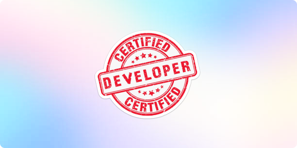

<!-- Elaborar meu Readme.md como se fosse um website, com header, navbar, banner, logo pessoal, body e footer -->
<!-- Seções: Heder, Navbar, Banner (será que pode vídeo?), Sobre, Stacks, Projetos, Contatos, Estatísticas, Footer -->

<!-- https://dev.to/envoy_/150-badges-for-github-pnk#github-stats -->

<header width="100%">
  
  

    <nav>
      <a href="#sobre">Sobre</a>&nbsp;&nbsp;&nbsp;&nbsp;&nbsp;
      <a href="#stack">Stack</a>&nbsp;&nbsp;&nbsp;&nbsp;&nbsp;
      <a href="#projetos">Projetos</a>&nbsp;&nbsp;&nbsp;&nbsp;&nbsp;
      <a href="#estatisticas">Estatísticas</a>&nbsp;&nbsp;&nbsp;&nbsp;&nbsp;
      <a href="#contatos">Contatos</a>
    </nav>
  

</header>

 

<main>
  
</main>

  

<section id="sobre">
  
    
  <h3>Geral</h3>
    
Eu me chamo <strong>Lucas Palhano</strong>, e sempre fui apaixonado por tecnologia e programação. Desde muito cedo eu já sonhava em empreender elaborando soluções elegantes para problemas do dia-a-dia. Minha missão sempre foi a de colaborar na criação de um futuro mais próspero, me reclinando na tecnologia como um meio de alcançar este objetivo.

  <h3>Hitórico</h3>
    
Meu primeiro contato com a programação veio muito cedo, ainda com 12 anos através do HTML e CSS. Mas foi só no ensino médio que eu pude realmente estudar conteúdos mais densos como Python, C e C++, no curso técnico de Eletrônica. Recentemente venho me dedicando ao estudo de tecnologias Fullstack.

  <h3>Objetivo</h3>
    
Tal como dito anteriormente, pretendo contribuir com a construção de um futuro melhor. Desta forma, pretendo aprender e trabalhar com quaisquer tecnologias que me permitam extrair meu máximo potencial. Atualmente, estou emprenhado em desenvolver minhas habilidades de Fullstac, mas sigo com alguma contato em Mobile e DevOps.

  <h3>Experiência</h3>
    
Já desenvolvi projetos próprios, tanto web Fullstack quanto Mobile. Ainda, também tenho experiência como freelancer e voluntário na organização JDG (Junior Developers Group). Além disso estou trabalhando em parceria com uma equipe de trabalho social para o desenvolvimento de um Marketplace para um bairro de Recife.

</section>

  

<section id="stack">
  
    
  <table align="center">
    <tr>
      <td align="center">
        <a href="https://pt-br.reactjs.org/">
           
          
            <strong>
              <pre>React.js</pre>
            </strong>
          
        </a>
      </td>
      <td align="center">
        <a href="https://nextjs.org/">
           
          
            <strong>
              <pre>Next.js</pre>
            </strong>
          
        </a>
      </td>
      <td align="center">
        <a href="https://www.typescriptlang.org/">
           
          
            <strong>
              <pre>Typescript</pre>
            </strong>
          
        </a>
      </td>
      <td align="center">
        <a href="https://tailwindcss.com/">
         
        
          <strong>
            <pre>Tailwind CSS</pre>
          </strong>
        
        </a>
      </td>
      <td align="center">
        <a href="https://github.com/">
           
          
            <strong>
              <pre>Git & Github</pre>
            </strong>
          
        </a>
      </td>
    </tr>
    <tr>
      <td align="center">
        <a href="https://styled-components.com/">
           
          
            <strong>
              <pre>Styled Components</pre>
            </strong>
          
        </a>
      </td>
      <td align="center">
        <a href="https://sass-lang.com/">
           
          
            <strong>
              <pre>Sass</pre>
            </strong>
        
        </a>
      </td>
      <td align="center">
        <a href="https://redux.js.org/">
           
          
            <strong>
              <pre>Redux Toolkit</pre>
            </strong>
          
        </a>
      </td>
      <td align="center">
        <a href="https://expressjs.com/">
           
          
            <strong>
              <pre>Express.js</pre>
            </strong>
          
        </a>
      </td>
      <td align="center">
        <a href="https://reactnative.dev/">
           
          
            <strong>
              <pre>React Native</pre>
            </strong>
          
        </a>
      </td>
    </tr>
    <tr>
      <td align="center">
        <a href="https://axios-http.com/docs/intro">
           
          
            <strong>
              <pre>Axios</pre>
            </strong>
          
        </a>
      </td>
      <td align="center">
        <a href="https://nodejs.org/en">
           
          
            <strong>
              <pre>Node.js</pre>
            </strong>
          
        </a>
      </td>
      <td align="center">
        <a href="https://developer.mozilla.org/en-US/docs/Web/JavaScript/">
           
          
            <strong>
              <pre>Javascript</pre>
            </strong>
          
        </a>
      </td>
      <td align="center">
        <a href="https://developer.mozilla.org/en-US/docs/Web/CSS/">
           
          
            <strong>
              <pre>CSS3</pre>
            </strong>
          
        </a>
      </td>
      <td align="center">
        <a href="https://developer.mozilla.org/en-US/docs/Web/HTML/">
           
          
            <strong>
              <pre>HTML5</pre>
            </strong>
          
        </a>
      </td>
    </tr>
    <tr>
      <td align="center">
        <a href="https://ohmyz.sh/">
           
          
            <strong>
              <pre>Shell Script</pre>
            </strong>
          
        </a>
      </td>
      <td align="center">
        <a href="https://code.visualstudio.com/">
           
          
            <strong>
              <pre>VSCode</pre>
            </strong>
          
        </a>
      </td>
      <td align="center">
        <a href="https://ubuntu.com">
           
          
            <strong>
              <pre>Linux</pre>
            </strong>
          
        </a>
      </td>
      <td align="center">
        <a href="https://www.python.org">
           
          
            <strong>
              <pre>Python</pre>
            </strong>
          
        </a>
      </td>
      <td align="center">
        <a href="https://www.cprogramming.com">
           
          
            <strong>
              <pre>C</pre>
            </strong>
          
        </a>
      </td>
    </tr>
    <tr>
      <td align="center">
        <a href="https://www.mysql.com">
           
          
            <strong>
              <pre>MySQL</pre>
            </strong>
          
        </a>
      </td>
        <td align="center">
        <a href="https://www.postgresql.org">
           
          
            <strong>
              <pre>PostgreSQL</pre>
            </strong>
          
        </a>
      </td>
      </td>
        <td align="center">
        <a href="https://www.figma.com">
           
          
            <strong>
              <pre>Figma</pre>
            </strong>
          
        </a>
      </td>
    </tr>
  </table>
</section>

  

<section id="projetos">
  
    
  <ul>
    <li>
      

        <strong><a href="https://searchin-beta.vercel.app/">Searchin</a></strong> - Uma start page voltada para buscas avançadas, realizadas diretamente nos principais mecanismos de búsca do mercado. Com suporte a mais de 100 websites, e construida com React e TypeScript.
      

    </li>
    <li>
      

        <strong><a href="https://lucaspalhano.com.br/">Portfólio</a></strong> - Website pessoal elaborado apenas com HTML5, SCSS e JavaScipt puros. A ideia foi me desafiar a fazer um sistema bonito sem a necessidade de frameworks. Contudo, devido a necessidade de escalar o projeto, pretendo migrar para algum framework, provavelmente NextJS.
      

    </li>
    <li>
      

        <strong><a href="https://github.com/Palhanor/Notely">Notely</a></strong> - Aplicativo minimalista para criação e gestão de notas baseadas em markdown. Tem o intúito de ser extremamente simples de usar, e é construído através do React Native com Expo, tendo o TypeScript como sua linguagem principal.
      

    </li>
    <li>
      

        <strong><a href="https://github.com/Palhanor/QR-Key">QR Key</a></strong> - Aplicativo móvel com foco na criação e leitura de QR Codes privados, acessíveis mediante uma senhas previamente configurada pelo seu criador. Criado através do React Native com Expo, e usando TypeScript como linguagem principal.
      

    </li>
    <li>
      

        <strong><a href="https://palhanor.github.io/Splittyn/">Splittyn</a></strong> - Sistema simples de divisão de despezas desenvolvido a partir de uma abordagem mobile first, e construído através da biblioteca React com TypeScript, fazendo uso do Recoil para a gestão dos estados globais.
      

    </li>
    <li>
      

        <strong><a href="https://palhanor.github.io/Pokedex/">Pokedex</a></strong> - Apesar de ser um projeto já bastante batido no mundo dos programadores Front-end, não deixa de ser uma boa pedida. Foram usados ReactJS e TypeScript, assim como o Axios para lidar com a PokeAPI.
      

    </li>
  </ul>
</section>

  

<section id="estatisticas">
  
    
  

    
    
  

</section>

  

<section id="contatos">
  
    
  

    
    
    
    
    
  

</section>

  

 

<footer width="100%">
  
&#169; 2023 Lucas Palhano Fonseca - Todos os direitos reservados.

</footer>
